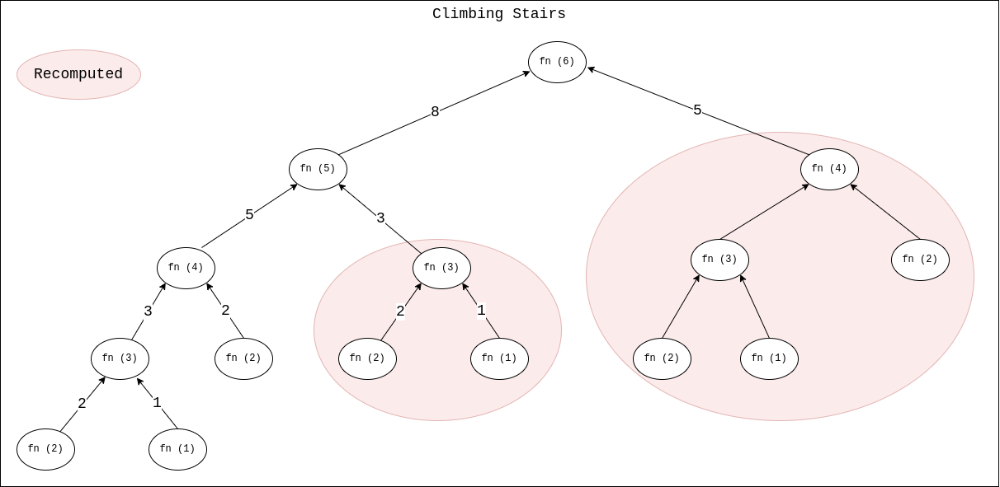

## Links
[Leetcode](https://leetcode.com/problems/climbing-stairs)

## Expected Output
No. of distinct way you can reach Nth step

**Base Cases:**
1. No of ways to reach `step_1`?
- 0 --> 1
- Only 1 way 

2. No of ways to reach `step_2`?
- 0 --> 1 --> 2
- 0 --> 2 
- Two ways



## Recursive Approach
1. We start from step n, we can reach to step 1 in two ways `(n - 1)` or `(n - 2)`
> Note: in mind the recusion stops when we reach step_2 or step_1

```
class Solution:
    def climbStairs(self, n: int) -> int:
        if n == 1 or n == 2:
            return n
        
        oneStep = self.climbStairs(n - 1)
        twoStep = self.climbStairs(n - 2)

        return oneStep + twoStep
```

## Memoization - Top Down
1. Use a dp[] array to avoid recomputation

**code**
```
class Solution:
    def climbstairs(self, n: int, dp: List[int]) -> int:
        if (n == 1 or n == 2):
            dp[n] = n
            return dp[n]
        
        if dp[n] != -1:
            return dp[n]
        
        oneStep = self.climbstairs(n - 1, dp)
        twoStep = self.climbstairs(n - 2, dp)

        dp[n] = oneStep + twoStep
        return dp[n]

    def climbStairs(self, n: int) -> int:
        dp = [-1] * (n + 1)

        self.climbstairs(n , dp)

        return dp[n]
```

## Tabulation - Bottom Up
Ways to reach `step_3` = Ways (`step_2`) + Ways (`step_1`)

**_By the same logic:_** 
Ways to reach `step_i` = Ways (`step_i-2`) + Ways (`step_i-1`)

In the dp array, dp[0], dp[1], dp[2] are base cases and need to be pre-assigned, for the rest of steps, we calculate the ways in a bottom up way using the ways to reach the prev two steps

**code**
```
class Solution:
    def climbStairs(self, n: int) -> int:
        if n == 1 or n == 2:
            return n
        
        dp = [0] * (n + 1)
        dp[1] = 1
        dp[2] = 2

        for i in range(3, n + 1):
            dp[i] = dp[i - 1] + dp[i - 2]
        
        return dp[n]
```