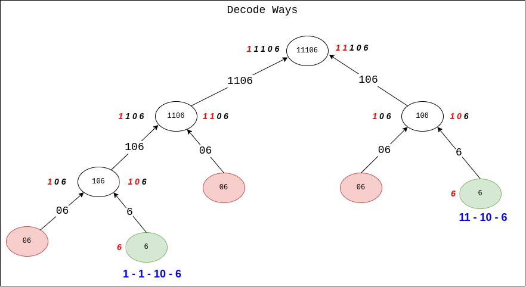

## Links
[Leetcode](https://leetcode.com/problems/decode-ways/description/)

## Expected Output
To number of ways you can decode the given string

## Approach
1. At every index, if the value is Non-Zero -> recur(index + 1), if you reach the end of string you've found one way to recur
2. At every index, do a second recur i.e., check if you can recur using two chars, (i, i+1)
    - `A[i] = 1`  ,  `(i + 1) e [0,9]` -> recur (i + 2)
    - `A[i] = 2`  ,  `(i + 1) e [0,6]` -> recur (i + 2)

**Edge Case:**
- If you get a `0` at an index -> return `0`



### Brute Force
```
class Solution:
    def numDecodings(self, s: str) -> int:
        def dfs(i):
            if i >= len(s):
                return 1
            
            if s[i] == "0":
                return 0
            
            oneChar = dfs(i + 1)

            twoChar = 0
            if (i+1) < len(s) and s[i] == "1" and s[i + 1] in "0123456789":
                twoChar += dfs(i + 2)
            elif (i+1) < len(s) and s[i] == "2" and s[i + 1] in "0123456":
                twoChar += dfs(i + 2)
            
            return oneChar + twoChar
        
        return dfs(0)
```

### Optimized (Memoization)

```
class Solution:
    def numDecodings(self, s: str) -> int:
        n = len(s)
        dp = {}

        def dfs(i):
            if i >= n:
                return 1

            if s[i] == "0":
                return 0
            
            if i in dp:
                return dp[i]
            
            oneChar = dfs(i + 1)

            twoChar = 0

            if (i+1) < len(s) and s[i] == "1":
                twoChar += dfs(i + 2)
            elif (i+1) < len(s) and s[i] == "2" and s[i + 1] in "0123456":
                twoChar += dfs(i + 2)
            
            dp[i] = oneChar = twoChar
            return dp[i]
        
        return dfs(0)
```