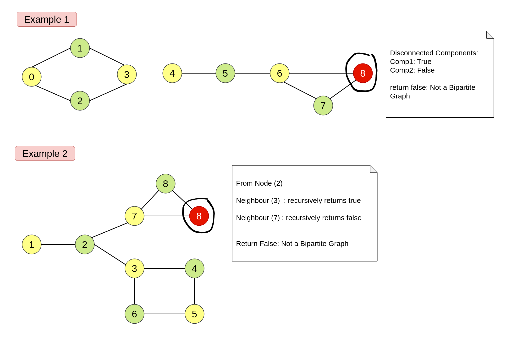

## Links
[Leetcode](https://leetcode.com/problems/is-graph-bipartite/description/)

## Expected Output
True: Graph is Bipartite
False: Graph is Not Bipartite

## Approach
1. Use a color[] to note the color of each node
2. If Node color is `0` none of it's neighbour must have color `1`,
   1. If a neighbour has color `0` it's not a bipartite graph
```
if( color[currNode] == color[neighbour] ) {
    return false; // not a bipartite graph
}
```   v 



**Approach**
```
class Solution {

    private boolean checkBfs(int start, int v, int[] color, int[][] graph) {
        Queue<Integer> q = new LinkedList<>();
        color[start] = 0;
        q.add(start);

        while( !q.isEmpty() ) {
            int currNode = q.poll();

            for(int neighbor : graph[currNode] ) {
                
                if(color[neighbor] == color[currNode]) { 
                    return false; // Not a Bipartite Graph : return false : main must toggle this
                } else if( color[neighbor] == -1 ) {
                    color[neighbor] = 1 - color[currNode];
                    q.offer(neighbor);
                }
            }
        }

        return true;
    }

    public boolean isBipartite(int[][] graph) {
        int v = graph.length;
        int[] color = new int[v];

        Arrays.fill(color, -1);

        for(int i = 0; i < v; i++) {
            if( color[i] == -1 ) {
                if( !checkBfs(i, v, color, graph) ) {
                    return false;
                }
            }
        }

        return true;
    }
}
```